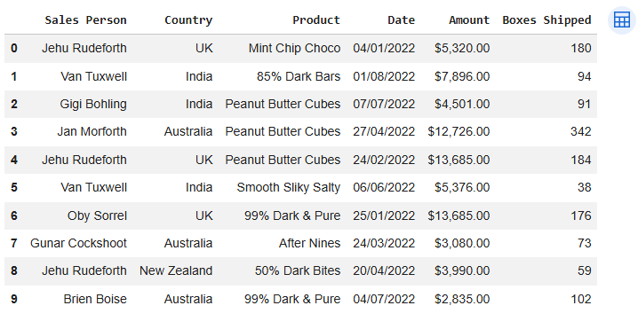
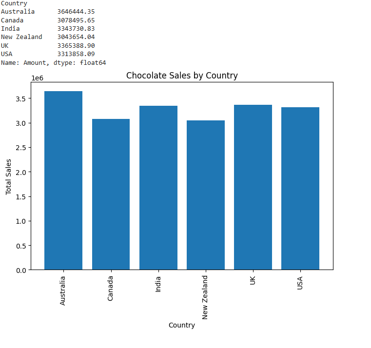
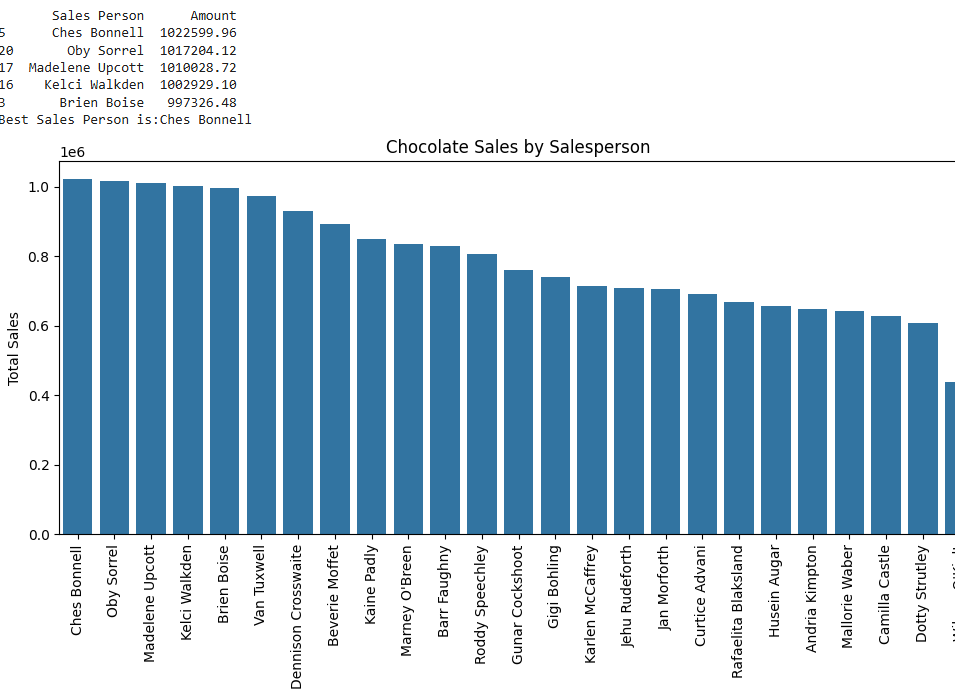
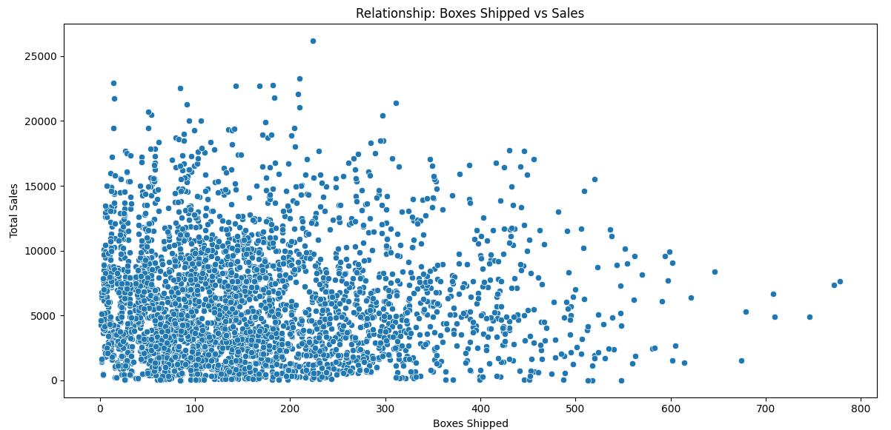
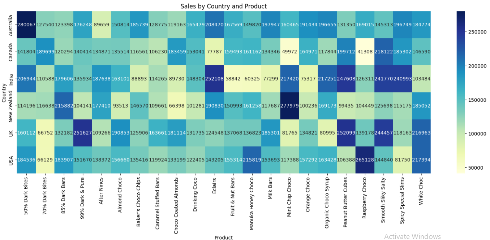
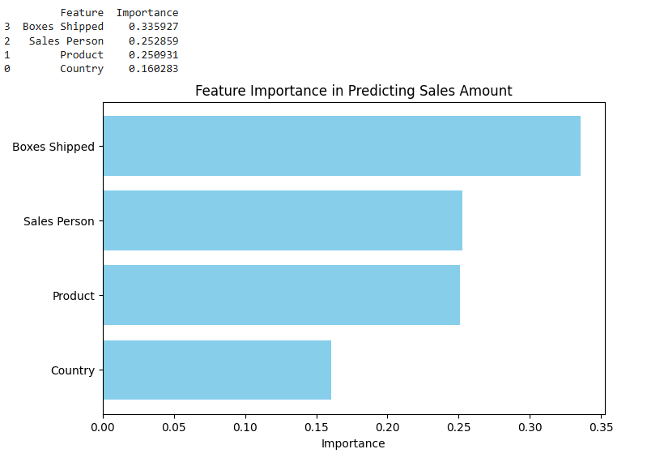

# Chocolate Sales Analysis

## Overview
This project analyzes chocolate sales data across different stores, countries, products, and time periods. The goal is to understand sales trends, customer preferences, and key factors influencing chocolate sales.

The analysis can be used for:

- Sales trend analysis
- Forecasting and predictive modeling
- Market segmentation and product analysis
- Data visualization projects

---

## Dataset Structure
The dataset (`chocolate_sales.csv`) contains the following columns:

| Column Name     | Data Type | Description |
|----------------|-----------|-------------|
| `Sales Person` | String    | Unique identifier for each salesperson |
| `Country`      | String    | Country where the sale occurred |
| `Product`      | String    | Name of the chocolate product |
| `Date`         | Date      | Date of the sales transaction (YYYY-MM-DD format) |
| `Amount`       | Float     | Total sales amount in USD for the transaction |
| `Boxes Shipped`| Int       | Number of chocolate boxes shipped in the transaction |

> Note: Column names may vary depending on your dataset.

---

## Sample Data



---

## Data Source
The dataset is collected from [Kaggle](https://www.kaggle.com/) and includes sales records across multiple countries, products, and sales personnel.

---

## Usage
This dataset can be used for:

- Python data analysis
- Machine learning tasks such as regression or forecasting
- Data visualization in Tableau, Power BI, or matplotlib/seaborn

---

## Python Example

```python
import pandas as pd
import seaborn as sns
import matplotlib.pyplot as plt

# Load the dataset
df = pd.read_csv("chocolate_sales.csv")

# Preview the first 5 rows
print(df.head())

```
---
## Data Visualization

**Total Sales by Country**



**Chocolate Sales by Product**


**Chocolate Sales by Sales Person**



**Relationship Between Box Shipped vs Sales**


**Check Best Sales by Coutry vs Product**


## Machine Learning model 

A Random Forest Regressor was trained to predict chocolate sales (Amount) based on Boxes Shipped, Product, Sales Person, and Country. 

**Performance Metrics**
* MAE: 1656.4123515529343
* R2 Score: 0.6817558759993125

### Feature Importance


### Observation

> The Random Forest model trained to predict chocolate sales demonstrates good predictive performance. The Mean Absolute Error (MAE) is ~1,656 units, meaning that on average, the model’s predicted sales deviate by ~28% from the actual sales (given the mean sales of ~6,030 units). The R² score is 0.682, indicating that the model explains approximately 68% of the variance in sales amounts across products, countries, and sales personnel.

* Boxes Shipped is the most influential factor (~35%).
* Product contributes ~25% of importance.
* Sales Person contributes ~24%.
* Country contributes the least (~16%).

> This suggests that optimizing shipment quantities, focusing on high-performing products, and leveraging strong sales personnel are key strategies. Country-specific strategies are less critical but can provide marginal gains


